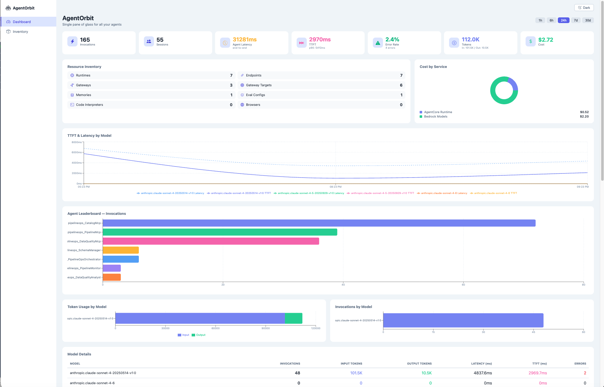
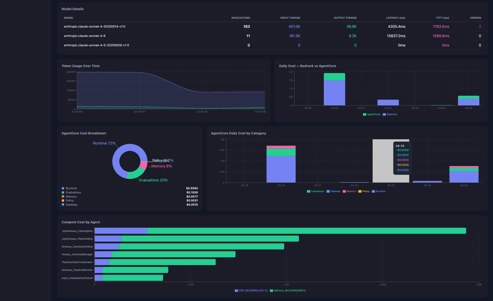
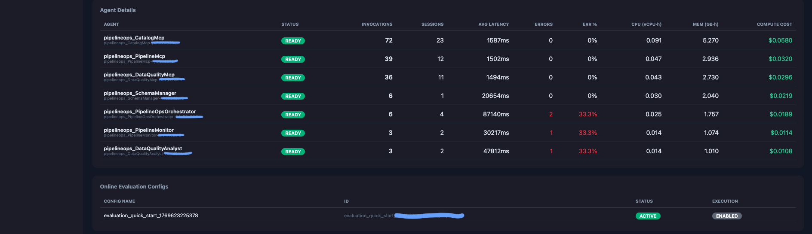
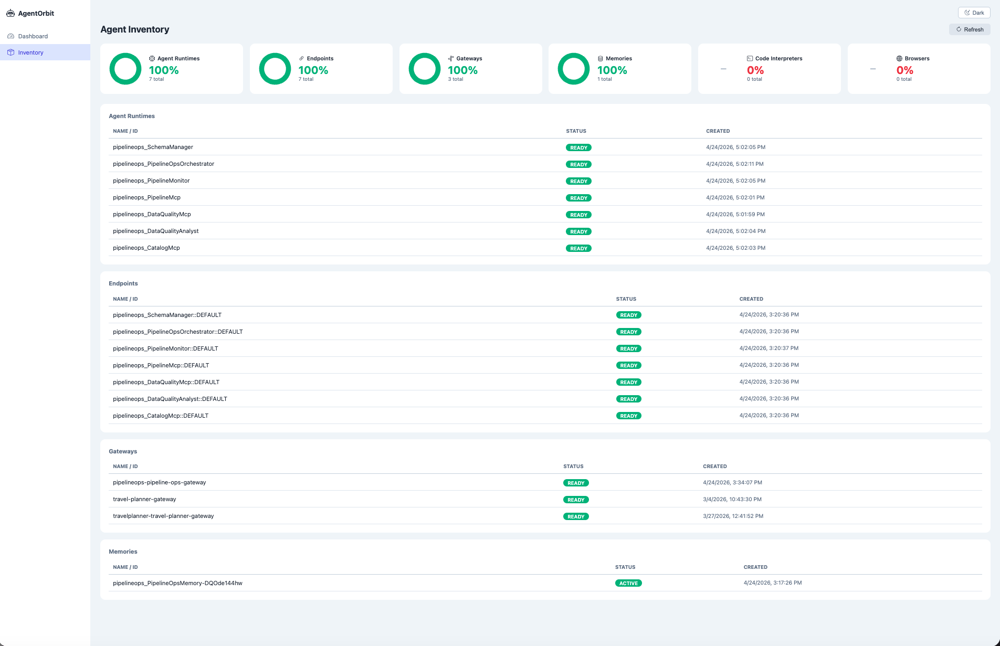

# AgentLook

**AgentLook** is an open-source, self-hosted observability dashboard for AI agents deployed on **AWS using Amazon Bedrock and Amazon Bedrock AgentCore**. It gives you a single pane of glass to monitor agent adoption, performance, cost, and health across your entire fleet — without building custom dashboards in CloudWatch.

Built for platform and leadership teams who need answers to: *Which agents are being used? What are they costing us? Are they performing well?*


## What You Get

### Dashboard (Home)
The executive view — everything at a glance.





#### KPI Cards

| Section | What It Shows | Data Source |
|---------|--------------|-------------|
| **KPI Cards** | Invocations, Sessions, Agent Latency, TTFT, Error Rate, Tokens, Cost | CloudWatch + Cost Explorer |

#### KPI Cards Explained

| KPI | What It Means | Source | How It's Calculated |
|-----|--------------|--------|---------------------|
| **Invocations** | Total number of API calls made to all your agents in the selected time range. Each call to `InvokeAgentRuntime` counts as one invocation. | `AWS/Bedrock-AgentCore` → `Invocations` metric (Sum), dimensions: `Resource`, `Operation=InvokeAgentRuntime`, `Name` | Summed across all agent runtimes |
| **Sessions** | Total unique conversation sessions across all agents. A session represents a continuous interaction between a user and an agent. | `AWS/Bedrock-AgentCore` → `Sessions` metric (Sum), dimensions: `Resource`, `Operation`, `Name` | Summed across all agent runtimes |
| **Agent Latency** | Average end-to-end processing time — from when the agent receives a request to when it sends the final response token. Includes model inference, tool calls, and all internal processing. | `AWS/Bedrock-AgentCore` → `Latency` metric (Average), dimensions: `Resource`, `Operation`, `Name` | Averaged across agents that have invocations. Not a sum — if 3 agents have avg latencies of 10s/20s/30s, this shows ~20s |
| **TTFT** | Time-to-First-Token — average time from when a streaming request is sent to when the first token is received back from the Bedrock model. This is a **model-level, account-wide** metric — not specific to AgentCore agents. The p90 value shows the 90th percentile (worst 10% of requests). | `AWS/Bedrock` → `TimeToFirstToken` metric (Average and p90), dimension: `ModelId` | Averaged across all models in the account. Only available for streaming API calls (`ConverseStream`, `InvokeModelWithResponseStream`) |
| **Error Rate** | Percentage of agent invocations that resulted in errors (both server-side 5xx and client-side 4xx). The subtitle shows the absolute error count. | `AWS/Bedrock-AgentCore` → `SystemErrors` + `UserErrors` metrics (Sum) | `(SystemErrors + UserErrors) / Invocations × 100` |
| **Tokens** | Total input + output tokens consumed across all Bedrock model invocations in the account. The subtitle breaks it down into input (prompt) and output (completion) tokens. This is account-wide, not per-agent. | `AWS/Bedrock` → `InputTokenCount` + `OutputTokenCount` metrics (Sum), no dimension filter | Summed across all models |
| **Cost** | Total spend on Amazon Bedrock (model invocations) + Amazon Bedrock AgentCore (runtime compute, memory, gateway, etc.) from AWS Cost Explorer. Minimum 7-day window. | AWS Cost Explorer → `GetCostAndUsage` API, filtered to services: `Amazon Bedrock`, `Amazon Bedrock Service`, `Amazon Bedrock AgentCore` | Sum of `UnblendedCost` across filtered services |

#### Model and Agent Metrics

| Section | What It Shows | Data Source |
|---------|--------------|-------------|
| **Resource Inventory** | Counts of runtimes, endpoints, gateways, targets, memories, eval configs, code interpreters, browsers | AgentCore Control Plane |
| **Cost by Service** | Pie chart: Bedrock Models vs AgentCore Runtime spend | Cost Explorer |
| **TTFT & Latency by Model** | Per-model time-to-first-token and invocation latency over time | `AWS/Bedrock` CloudWatch |
| **Agent Leaderboard** | Horizontal bar chart ranking agents by invocations | `AWS/Bedrock-AgentCore` CloudWatch |
| **Per-Model Metrics** | Token usage and invocations broken down by model | `AWS/Bedrock` CloudWatch |
| **Model Details Table** | Per-model: invocations, input/output tokens, latency, TTFT, errors | `AWS/Bedrock` CloudWatch |
| **Token Usage Over Time** | Area chart of input vs output tokens | `AWS/Bedrock` CloudWatch |
| **Daily Cost (Bedrock vs AgentCore)** | Stacked bar chart of daily spend by service | Cost Explorer |
| **AgentCore Cost Breakdown** | Pie + stacked bar: Runtime, Memory, Gateway, Evaluations, Policy costs | Cost Explorer (usage types) |
| **Compute Cost by Agent** | Per-agent CPU + Memory cost at published rates ($0.0895/vCPU-hr, $0.00945/GB-hr) | `AWS/Bedrock-AgentCore` CloudWatch |
| **Agent Details Table** | Per-agent: status, invocations, sessions, latency, errors, CPU, memory, compute cost | CloudWatch |
| **Evaluation Configs** | Online evaluation configurations with status | AgentCore Control Plane |

### Inventory
Detailed resource tables with health status pie charts for all AgentCore resource types.



## Architecture

```
┌─────────────────────┐     ┌──────────────────────┐
│  React + TypeScript │────▶│   FastAPI (Python)   │
│  Recharts, Router   │     │   boto3 services     │
└─────────────────────┘     └──────┬───────────────┘
                                   │
                ┌──────────────────┼──────────────────┐
                ▼                  ▼                  ▼
        ┌──────────┐    ┌──────────┐    ┌──────────┐    ┌──────────┐
        │ AgentCore│    │ AgentCore│    │CloudWatch│    │   Cost   │
        │ Control  │    │   Data   │    │ Metrics  │    │ Explorer │
        │  Plane   │    │  Plane   │    │ & Logs   │    │          │
        └──────────┘    └──────────┘    └──────────┘    └──────────┘
```

### AWS Services Used

| Service | Client | What For |
|---------|--------|----------|
| `bedrock-agentcore-control` | Control Plane | List runtimes, endpoints, gateways, memories, evaluators, eval configs, code interpreters, browsers |
| `bedrock-agentcore` | Data Plane | Sessions, events, on-demand evaluations |
| `cloudwatch` | Metrics | Per-agent invocations/latency/errors/CPU/memory, per-model tokens/TTFT/latency |
| `ce` | Cost Explorer | Bedrock + AgentCore cost breakdown by service and usage type |

### CloudWatch Namespaces

| Namespace | Metrics | Dimensions |
|-----------|---------|------------|
| `AWS/Bedrock-AgentCore` | Invocations, Sessions, Latency, SystemErrors, UserErrors, Throttles, CPUUsed-vCPUHours, MemoryUsed-GBHours | `Resource` (ARN), `Operation`, `Name` (endpoint) |
| `AWS/Bedrock` | Invocations, InputTokenCount, OutputTokenCount, InvocationLatency, TimeToFirstToken, InvocationClientErrors, InvocationServerErrors | `ModelId` |

## Prerequisites

- **Python 3.10+**
- **Node.js 18+**
- **AWS credentials** configured via environment variables, `~/.aws/credentials`, or instance profile
- **boto3 >= 1.42.0** (for `bedrock-agentcore-control` and `bedrock-agentcore` service support)

## IAM Permissions

The IAM principal running the dashboard backend needs the following permissions:

```json
{
  "Version": "2012-10-17",
  "Statement": [
    {
      "Sid": "AgentCoreControlPlane",
      "Effect": "Allow",
      "Action": [
        "bedrock-agentcore-control:ListAgentRuntimes",
        "bedrock-agentcore-control:GetAgentRuntime",
        "bedrock-agentcore-control:ListAgentRuntimeEndpoints",
        "bedrock-agentcore-control:ListGateways",
        "bedrock-agentcore-control:ListGatewayTargets",
        "bedrock-agentcore-control:ListMemories",
        "bedrock-agentcore-control:ListEvaluators",
        "bedrock-agentcore-control:ListOnlineEvaluationConfigs",
        "bedrock-agentcore-control:GetOnlineEvaluationConfig",
        "bedrock-agentcore-control:ListCodeInterpreters",
        "bedrock-agentcore-control:ListBrowsers"
      ],
      "Resource": "*"
    },
    {
      "Sid": "AgentCoreDataPlane",
      "Effect": "Allow",
      "Action": [
        "bedrock-agentcore:ListSessions",
        "bedrock-agentcore:ListEvents",
        "bedrock-agentcore:ListActors",
        "bedrock-agentcore:Evaluate"
      ],
      "Resource": "*"
    },
    {
      "Sid": "CloudWatchMetrics",
      "Effect": "Allow",
      "Action": [
        "cloudwatch:GetMetricData",
        "cloudwatch:ListMetrics"
      ],
      "Resource": "*"
    },
    {
      "Sid": "CostExplorer",
      "Effect": "Allow",
      "Action": [
        "ce:GetCostAndUsage"
      ],
      "Resource": "*"
    }
  ]
}
```

## Quick Start

### Without Docker (recommended for development)

```bash
# Clone the repo
git clone <repo-url>
cd agentlook

# Backend
cd backend
python3 -m venv .venv && source .venv/bin/activate
pip install -r requirements.txt
uvicorn app.main:app --reload --port 8000

# Frontend (separate terminal)
cd frontend
npm install
npm run dev

# Dashboard: http://localhost:5173
# API docs:  http://localhost:8000/docs
```

### With Docker

```bash
docker-compose up --build

# Frontend: http://localhost:5173
# Backend:  http://localhost:8000
```

### Production

```bash
docker-compose -f docker-compose.prod.yml up --build -d

# Dashboard: http://localhost (port 80, nginx proxy)
```

## Configuration

| Environment Variable | Default | Description |
|---------------------|---------|-------------|
| `AGENTLOOK_AWS_REGION` | `us-east-1` | AWS region for all boto3 clients |
| `AGENTLOOK_CW_NAMESPACE` | `AWS/Bedrock-AgentCore` | CloudWatch namespace for AgentCore metrics |
| `AGENTLOOK_SPANS_LOG_GROUP` | `/aws/spans/default` | CloudWatch log group for OTEL spans |
| `VITE_API_URL` | `http://localhost:8000` | Backend API URL (frontend build-time) |

## Enabling AgentCore Observability

For the dashboard to show per-agent metrics (invocations, latency, CPU, memory), AgentCore must be publishing metrics to CloudWatch. This happens automatically when agents are deployed on AgentCore Runtime.

### Cost Explorer

Cost Explorer must be enabled in your AWS account (it's on by default for most accounts). The dashboard queries costs for services: `Amazon Bedrock`, `Amazon Bedrock Service`, and `Amazon Bedrock AgentCore`.

## Metrics Reference

### Per-Agent Metrics (from `AWS/Bedrock-AgentCore`)

| Metric | Type | Description |
|--------|------|-------------|
| Invocations | Sum | Total API calls to the agent |
| Sessions | Sum | Number of unique sessions |
| Latency | Average | End-to-end request processing time (ms) |
| SystemErrors | Sum | Server-side errors (5xx) |
| UserErrors | Sum | Client-side errors (4xx) |
| Throttles | Sum | Requests throttled (429) |
| CPUUsed-vCPUHours | Sum | CPU consumption in vCPU-hours |
| MemoryUsed-GBHours | Sum | Memory consumption in GB-hours |

### Per-Model Metrics (from `AWS/Bedrock`)

| Metric | Type | Description |
|--------|------|-------------|
| Invocations | Sum | Model invocation count |
| InputTokenCount | Sum | Input tokens consumed |
| OutputTokenCount | Sum | Output tokens generated |
| InvocationLatency | Average | Full model invocation latency (ms) |
| TimeToFirstToken | Average | Time to first token for streaming APIs (ms) |
| InvocationClientErrors | Sum | Client errors |
| InvocationServerErrors | Sum | Server errors |

### Cost Metrics (from Cost Explorer)

| Category | Description | Pricing |
|----------|-------------|---------|
| **Bedrock Models** | Token-based charges for model invocations (Claude, etc.) | Per-token, varies by model |
| **AgentCore Runtime** | Compute charges for agent execution | $0.0895/vCPU-hour, $0.00945/GB-hour |
| **AgentCore Memory** | Short-term memory events, long-term storage & retrieval | $0.25/1K events, $0.75/1K records/mo, $0.50/1K retrievals |
| **AgentCore Gateway** | API invocations, tool indexing, search | $0.005/1K invocations |
| **AgentCore Evaluations** | Built-in evaluator input/output tokens | Per-token |
| **AgentCore Policy** | Authorization API calls, generation tokens | Per-invocation |

## API Endpoints

| Method | Path | Description |
|--------|------|-------------|
| `GET` | `/health` | Health check |
| `GET` | `/api/dashboard?hours=24` | Aggregated dashboard data (single call) |
| `GET` | `/api/inventory/runtimes` | List agent runtimes |
| `GET` | `/api/inventory/runtimes/{id}/endpoints` | List runtime endpoints |
| `GET` | `/api/inventory/gateways` | List gateways |
| `GET` | `/api/inventory/gateways/{id}/targets` | List gateway targets |
| `GET` | `/api/inventory/memories` | List memories |
| `GET` | `/api/health/overview` | Aggregated resource health with status counts |
| `GET` | `/api/evaluations/evaluators` | List evaluators |
| `GET` | `/api/evaluations/configs` | List online evaluation configs |
| `GET` | `/api/metrics/runtime?hours=24` | Runtime CloudWatch metrics |
| `GET` | `/api/metrics/gateway?hours=24` | Gateway CloudWatch metrics |
| `GET` | `/api/metrics/leaderboard?hours=24` | Per-agent metric leaderboard |
| `GET` | `/api/metrics/tokens?hours=24` | Account-wide token usage |

### Debug Endpoints (disabled by default, enable with `AGENTLOOK_DEBUG_ENDPOINTS=true`)

| Method | Path | Description |
|--------|------|-------------|
| `GET` | `/api/debug/namespaces` | List CloudWatch namespaces with Bedrock/AgentCore metrics |
| `GET` | `/api/debug/namespace-detail?ns=X` | List all metrics and dimensions in a namespace |
| `GET` | `/api/debug/cost` | Test Cost Explorer access |
| `GET` | `/api/debug/cost-services` | List all services with cost |
| `GET` | `/api/debug/observability` | Check observability status (namespaces, log groups) |

## Troubleshooting

### Agent details show all zeros
The CloudWatch namespace might not match. Hit `/api/debug/observability` to see which namespaces are active. The dashboard auto-detects from: `AWS/Bedrock-AgentCore`, `Bedrock-AgentCore`, `Bedrock-Agentcore`.

### No cost charts
Cost Explorer needs to be enabled in your AWS account. Hit `/api/debug/cost` to verify access. Also check that the IAM principal has `ce:GetCostAndUsage` permission.

### TTFT chart empty
`TimeToFirstToken` is only emitted for streaming API calls (`ConverseStream`, `InvokeModelWithResponseStream`). If your agents use non-streaming APIs, this metric won't have data.

## Tech Stack

- **Frontend**: React 19, TypeScript, Recharts, React Router, Vite
- **Backend**: FastAPI, Python 3.10+, boto3
- **Styling**: CSS custom properties (light/dark theme), Bootstrap Icons

## Contributing

1. Fork the repository
2. Create a feature branch (`git checkout -b feature/my-feature`)
3. Commit your changes
4. Push to the branch and open a Pull Request

## License

MIT-0
